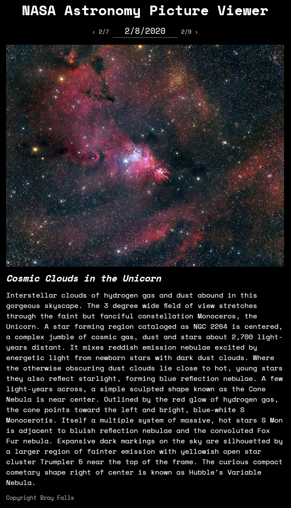

# NASA Astronomy Picture Viewer

This is a React app that incorporates the NASA Astronomy Picture of the Day API.

# Preview




# Installation

```
npm install
npm run build
npm start

# you can also run dev mode
npm run dev
```

You should be able to see the app at [localhost:3000](http://localhost:3000).

# Features
- Server-side rendering
- Client-side fetching and caching
- Date input (change date through text or calendar)
- Previous/next day navigation
- Links to view HD images
- Embedded videos
- Date validation (using API's min/max dates)

# Details
I used a few dependencies to make this easier to develop while also preparing it for production.

- [next](https://nextjs.org/): React framework (server-rendering, routing, PWA/static site features).
- [styled-components](https://styled-components.com/): Component-based, modular styling. Integrated with Next.js to inline critical styles.
- [styled-reset](https://www.npmjs.com/package/styled-reset): reset.css for styled-components.
- [react-day-picker](https://react-day-picker.js.org/): Date input component (flexible options, easy to style, accessible).
- [date-fns](https://date-fns.org/): Modern date/time library (like lodash for dates).
- [react-player](https://www.npmjs.com/package/react-player): I used this for a client recently. I noticed the API gave some video URLs, which I was able to plug into this component.
- [isomorphic-unfetch](https://www.npmjs.com/package/isomorphic-unfetch): fetch for the browser and server (see [fetchApod.js](./utils/fetchApod.js)).
- [swr](https://github.com/zeit/swr): A React hook I started using recently for remote data fetching. Provides key-based caching. The initial data is fetched by the server and populates useSWR. Subsequent requests are made client-side through this hook.
- [react-use](https://github.com/streamich/react-use): Library of React hooks (I used `usePreviousDistinct` to keep old data in between pages).

# Future Work
- There's room for a spiffier design, maybe using NASA's color scheme.
- Lazy-load image URLs to keep the content from jumping down.
- Buttons for `Today` and `Random Day`.
- Show previews of other days (either for adjacent days, or for a whole calendar).